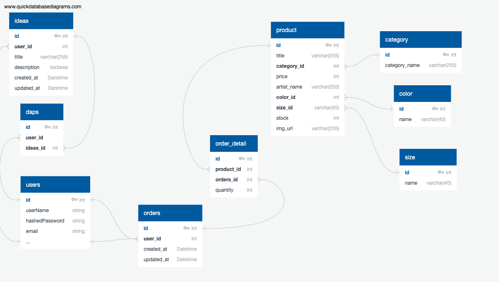

# Welcome to ColorCoded
ColorCoded is an e commerce website that caters to coding themed clothing.  Here at ColorCoded, you can browse the t-shirt shop for coding themed shirts.  The site also host a t-shirt idea forum that allows users to share their t-shirt ideas.

# Introduction and Features

This project serves as the capstone that displays the knowledge and skills I've learned over the past 6 months.  The initial t-shirts designs on the site are coding themed, but with an ethnic twist. The site aims to relate the coding world with people of color.

- **T-shirt Ideas forum**: Users will be able to CRUD their t-shit ideas to the forum.
- **T-shirt Shop** Users can browse the t-shirt shop and add an order to the cart.
- **Bonus! Code Repl: Users can write code in the site repl, take a screenshot of the code snippet, and print that to a shirt.

## Technologies Used
**Backend**
- Python (Flask)
- SQLAlchemy Object Relational Mapper
- Werkzeug
- pyjwt. Generates javascript web tokens for user sessions
- Alembic. Engine for database relational migrations

**Frontend**
- React.js
- Material UI

## Database and Schema

**users**
- has many orders
- has many ideas

**idea**
- belongs to user
- has many daps

**daps**
- belongs to ideas
- belongs to user

**orders**
- has many order_detail
- many to many with products
- belongs to users via user_id

**order_detail**
- belongs to orders
- belongs to products

**product**
- belongs to color_id
- belongs to size_id
- belongs to category
- many to many with orders

**product_variant**
- has many order_detail
- belongs to product

**category**
- has many products

## Frontend Routes
**Splash**
- / -> Home page welcomes new and existing users with cool graphic

**Authentication**
- /sign-up -> signs up for an account
- /login -> Existing users sign-in

**Ideas**
- /ideas/create -> Existing user can post an idea to the forum
- /ideas -> Listing of all user ideas
- /users/ideas/id -> show a list of individual user ideas

**T-shirt Shop**
- /t-shirt -> Listing of all t-shirts in the store
- /t-shirt/id -> list of individual shirts
- /cart -> shows a list of items in cart

## API Documentation
**Resources**
- Users
- Ideas
- Daps
- Product
- cart(local storage?)
- Orders

### Users
**Endpoints for User**
- Login POST -> /api/session
- Sign Up POST -> /api/users
- Log out DELETE -> /
- Retrieve all ideas owned by single user GET -> /api/users/ideas

### Ideas
- Create an idea -> POST /api/ideas
-  Retrieve all ideas -> GET /api/ideas
-  Update an idea -> PUT /api/ideas/<id>
-  Delete an idea -> DELETE /api/ideas/<id>

### Daps
- Give an Idea daps -> POST /api/ideas/daps
- Remove a dap from and idea -> DELETE /api/ideas/daps

### Product
- Retrieve a list of all products -> GET /api/t-shirt
- Retrieve one t-shirt -> GET /api/t-shirt/<id>

### Cart
- Retrieve all items in cart -> GET /api/cart
- Update order details in cart -> PUT /api/cart
- Remove Item from cart -> DELETE /api/cart

## Components
- User
- NavBar
- Product
- Cart
- Ideas
- Daps
- Orders
- Forms
